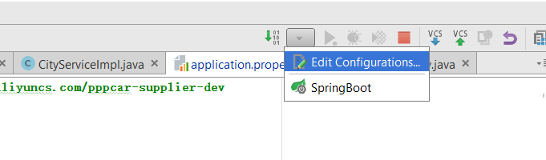
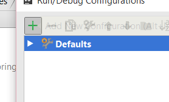
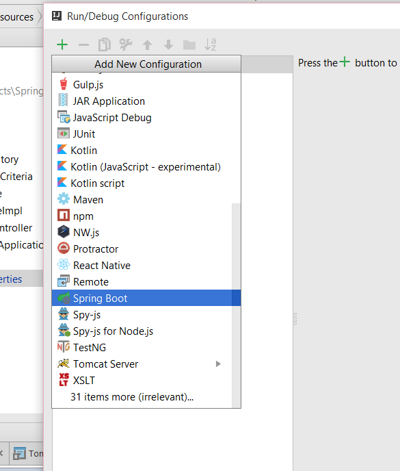
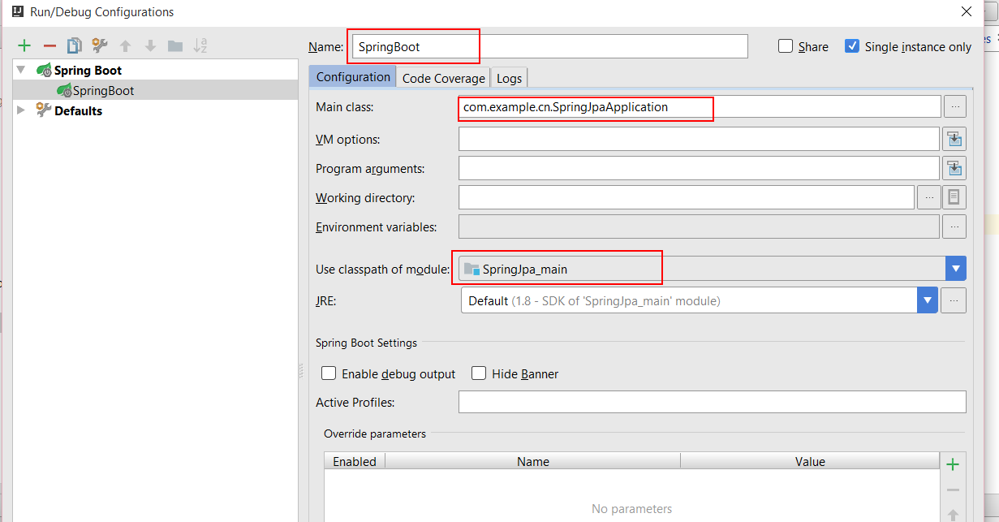
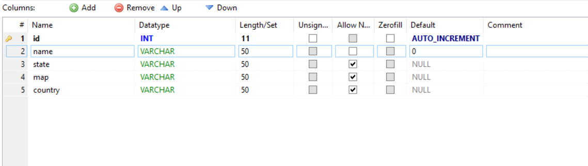

# springboot_datajpa_mysql
springboot_datajpa_mysql实例
其实spring官方文档已经很详细了，这个只是一个springboot的一个小实例，如果Intellij Idea项目结构不熟悉你可以到
[springboot配置](http://start.spring.io/)配置gradle项目下载下来用Intellij Idea打开就可以
代码本身很简单，我这里简单讲一下怎么用Intellij Idea跑这个项目      

以下是我的数据库表结构

